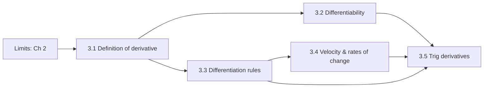

<!-- EXAMPLE: a finished Course Map for a calculus class with the textbook in _sources/. Model new classes on this. -->
---
course: AP Calculus BC
textbook: "Finney, Demana, Waits, Kennedy, Bressoud: Calculus: Graphical, Numerical, Algebraic, 5th ed. (AP edition)"
pdf: "_sources/textbook.pdf"
pagemap: "_sources/textbook.pdf.pagemap.json"
---
# AP Calc BC: Course Map

**Textbook:** *Calculus: Graphical, Numerical, Algebraic* (5th ed.). Page numbers below are **printed** pages. `tools/pdf.py` converts them automatically using the page map. Printed p.127 is missing from this PDF.

## Upcoming
| Date | What | Covers |
|---|---|---|
| YYYY-MM-DD | **Test: Chapter 3, Derivatives** | §3.1–3.5 |

## Chapter 3: Derivatives (pp. 100–153)
Extracted text is in `_sources/text/`.

### 3.1 Derivative of a Function (pp. 101–110)
- Limit definition $f'(x)=\lim_{h\to0}\frac{f(x+h)-f(x)}{h}$ and the alternate form $f'(a)=\lim_{x\to a}\frac{f(x)-f(a)}{x-a}$
- Notation: $f'(x)$, $y'$, $\frac{dy}{dx}$, $\frac{d}{dx}f(x)$
- Relationships between the graphs of $f$ and $f'$; graphing $f'$ from $f$ and $f$ from $f'$
- Graphing the derivative from data; one-sided derivatives

### 3.2 Differentiability (pp. 111–117)
- How $f'(a)$ can fail to exist: corner, cusp, vertical tangent, discontinuity
- Differentiability implies local linearity
- Numerical derivatives on a calculator (NDER, symmetric difference quotient)
- Differentiability ⇒ continuity (not the reverse)
- Intermediate Value Theorem for derivatives

### 3.3 Rules for Differentiation (pp. 118–128)
- Constant, power (integer powers), constant multiple, sum/difference rules
- Product and quotient rules
- Negative integer powers
- Second and higher-order derivatives

### 3.4 Velocity and Other Rates of Change (pp. 129–142)
- Instantaneous rate of change
- Motion along a line: position, velocity, speed, acceleration; free fall
- Sensitivity to change
- Derivatives in economics: marginal cost/revenue

### 3.5 Derivatives of Trigonometric Functions (pp. 143–149)
- $\frac{d}{dx}\sin x=\cos x$, $\frac{d}{dx}\cos x=-\sin x$ (from $\lim\frac{\sin h}{h}=1$)
- Simple harmonic motion; jerk
- $\tan, \cot, \sec, \csc$ derivatives via the quotient rule
- Why radians matter

### Chapter 3 Review Exercises (pp. 150–153)
"Ch3 Rv" = these. Key Terms list is on p.150.

## Answer key
Odd-numbered answers are in *Selected Answers* at the back (pp. 615+). Chapter 3 is on pp. 627–631. Index: `_sources/answers-index.md`. Use them only to check {{NAME}}'s answers after they have one.
